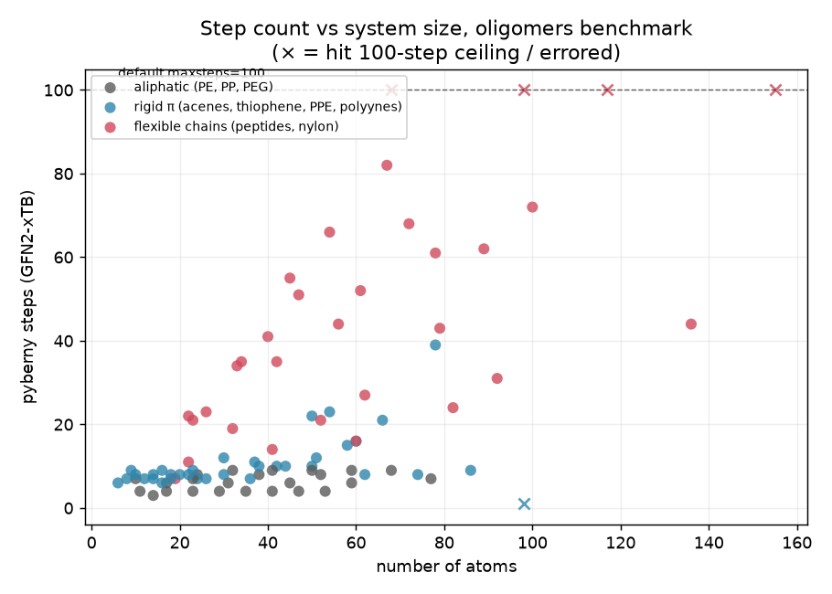
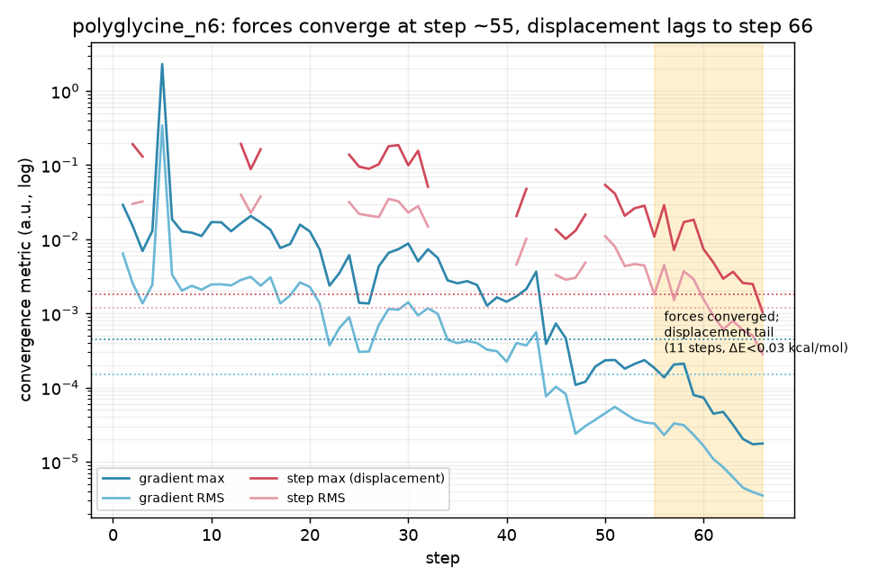
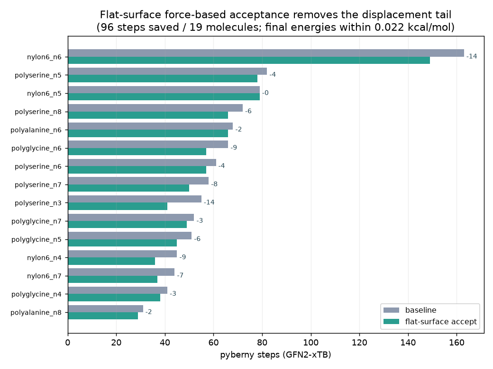

# Oligomer long convergers are a soft-mode displacement-criterion tail, not a hard surface

*Investigation, 2026-07-18. GFN2-xTB via `tblite`. Follows up the oligomer
noise-stability study
([`2026-06-22-oligomers-noise-stability`](../2026-06-22-oligomers-noise-stability),
[#170](https://github.com/jhrmnn/pyberny/issues/170)), which flagged the
flexible peptide/nylon chains as the step-count and ceiling-failure hotspots but
did not root-cause them. All per-step numbers come from the trace artifacts of
the `oligomers` `xtb` Benchmark dispatch on `master` @ `2c73223` (the run that
seeded this investigation); the fix experiment and figures are regenerated by
`scripts/`. Raw data in `data/`.*

## TL;DR

The oligomer "long convergers" — the flexible **peptide** (poly-glycine /
-alanine / -serine) and **nylon-6** chains that take 40–80+ steps or hit the
100-step ceiling — are **not a fundamentally hard potential-energy surface, and
not an optimizer breakdown.** They are a **displacement-criterion tail** driven
by soft torsional modes.

- **The binding constraint is displacement, not force.** Across the 86 converged
  molecules the *last* criterion to be satisfied is a **step (displacement)**
  criterion in 63 cases and a **gradient (force)** criterion in only 23; among
  the 18 long convergers (≥30 steps) it is `Step maximum`/`Step RMS` in
  **all 18**.
- **~1/6 of all optimizer work is spent after the energy is already at the
  minimum.** 322 of the 2003 total steps in the set happen *after* both force
  criteria are already met and stay met to the end; over those 322 steps the
  energy moves by a median of **0.0005** and a max of **0.045 kcal/mol**.
- **Mechanism: soft modes amplify residual force into displacement.** In the
  tail the lowest Hessian eigenvalue is ~1–6 × 10⁻⁴ (an ultra-soft torsion). A
  Newton/RFO step along it is ≈ *g*/λ, so a residual gradient already below the
  `0.45e-3` threshold still produces a displacement several × the tight
  `stepmax = 1.8e-3` / `steprms = 1.2e-3` cutoffs. The **trust region is healthy**
  (Fletcher ratio ≈ 0.8–1.1, trust 0.2–0.34, most tail steps *not* on the trust
  sphere), so this is not a trust or Hessian-quality failure.
- **The number of soft modes grows with chain length,** so the tail grows with
  size and pushes the largest floppy chains past the 100-step default. But they
  are **not stuck**: with the ceiling lifted, `nylon6_n5` → 134, `nylon6_n6` →
  148, `polyglycine_n8` → 226 steps, all converged.

**There is a viable, well-precedented fix:** accept convergence on **forces +
flat energy** (Gaussian's rule), i.e. when both gradient criteria are met *and*
the predicted energy change of the step is below a small `flat_energy`
threshold, even if the displacement criteria are not. A ~15-line prototype
(`flat_accept.patch`) saves **96 steps across 19 molecules** (up to −14 each)
with final energies within **0.022 kcal/mol** of baseline and endpoint
geometries far inside the chains' own intrinsic conformational scatter.

## The two questions, answered

**Fundamentally hard?** No. Energy and forces converge at a normal rate; the
surfaces are ordinary shallow minima, not pathological. Every "non-converger" at
the default `maxsteps=100` is a false negative that converges with more steps
(above). The excess steps buy geometric precision along near-zero-curvature
modes that is chemically meaningless at the energy scale involved.

**Viable algorithmic fix?** Yes, and it is standard practice. Gaussian (and most
production optimizers) declare convergence when the forces are converged and the
surface is flat (small predicted/actual energy change), *regardless of the
displacement*. pyberny currently requires all four of {grad-max, grad-RMS,
step-max, step-RMS} unconditionally, so it keeps stepping down a flat soft mode
long after it is at the minimum.

## Evidence

### 1. Flexibility, not size, drives the step count



Rigid π systems (acenes, thiophenes, PPE, poly-ynes) and aliphatics (PE, PP,
PEG) stay at <25 steps regardless of size — decacene (66 atoms) takes 21,
polyethylene_n8 (53 atoms) takes 4. The flexible chains fan upward with length
and are the only family to reach the ceiling. (The one rigid × is `PPE_n8`,
which errors at step 1 — a separate SCF/fragmentation issue, see the
[PPE report](../2026-06-26-ppe-coordinateerror-fragmentation).)

### 2. Forces converge early; displacement lags



`polyglycine_n6` is representative: the gradient max/RMS (blue) drop below their
thresholds around step ~55 and stay there, while the step max/RMS (red) stay
several × above their thresholds for 11 more steps (shaded). Over that tail the
energy changes by <0.03 kcal/mol total. The step curves are gapped because
on-sphere steps report "minimization on sphere" in place of the step criteria.

`scripts/gap.py` quantifies this over the whole set: 322 wasted-tail steps,
median predicted |ΔE| 0.0005 kcal/mol, median `stepMax`/threshold ratio 3.5×.
`scripts/mechanism.py` confirms the lowest Hessian eigenvalue in those tail
steps is a median of 6 × 10⁻⁴ (min 1 × 10⁻⁴) — the soft-mode amplifier.

### 3. The ceiling failures are marginal, not hard

| molecule | atoms | default (maxsteps=100) | ceiling lifted |
|---|---:|---|---:|
| nylon6_n5 | 98 | null (non-converged) | 134 |
| nylon6_n6 | 117 | null (non-converged) | 148 |
| polyglycine_n8 | 68 | null (non-converged) | 226 |

These sit right at the margin: GFN2-xTB step counts for the floppy chains are
not bitwise reproducible across runners (as the benchmark `SOURCE.md` already
notes), and a separate `maxsteps=200` rerun landed `nylon6_n5` at **79** and
`nylon6_n6` at **163** — i.e. the same molecule falls on either side of the
ceiling depending on numerical noise. That marginality is itself a symptom of
the tail: the run finishes when the last soft-mode displacement happens to dip
under `stepmax`.

### 4. The fix works, and is safe



Prototype (`flat_accept.patch`): in `is_converged`, if both gradient criteria
are met and |predicted ΔE| < `flat_energy` (set to 1 × 10⁻⁶ Ha ≈ 6 × 10⁻⁴
kcal/mol in the experiment), accept. Disabled by default (`flat_energy = 0`), so
existing behaviour is unchanged unless opted in.

- **96 steps saved across 19 molecules**, up to −14 (`polyserine_n3`,
  `nylon6_n6`); the flexible chains shrink ~15 %.
- **Final energies within 0.022 kcal/mol** of baseline for every molecule that
  converged under both settings.
- **Endpoint geometry stays inside the intrinsic conformational scatter.** Proper
  Kabsch RMSD (`scripts/rmsd_check.py`): the fix moves `polyglycine_n6` by
  0.039 Å and `nylon6_n4` by 0.144 Å, versus **1.47 Å and 2.92 Å** between two
  *baseline* runs from a tiny 0.02 Å start perturbation — the fix perturbs the
  answer ~10–40× less than the optimizer's own start-dependent scatter.
- **Controls are essentially untouched:** `polyethylene_n8` 4 → 4 (identical
  geometry).

### Honest caveats

- **The fix does not rescue the genuinely slow tail.** `polyglycine_n8` needs
  ~226 steps just to converge its *forces*, so the force-gated accept never
  fires within 100 (or 200) steps. The very floppiest chains need either a
  higher `maxsteps` or deeper work (soft-mode preconditioning / a better
  torsional Hessian model), not a criterion tweak.
- **The `flat_energy` threshold is a real knob.** At 1 × 10⁻⁶ Ha it also shaves
  a step or two off rigid molecules (`thiophene_n4` 12 → 9, `anthracene` 7 → 6),
  which is harmless energetically but means adopting this by default would
  **shift the whole `reference.json` step baseline** and require reseeding the
  benchmark. And on a molecule whose minimum *is* well defined (`polyserine_n3`,
  where two noise seeds land 0.001 Å apart) the accept loosens the geometry by
  0.165 Å — so a more conservative threshold (e.g. 1 × 10⁻⁷ Ha) trades fewer
  saved steps for tighter geometry. This wants a small threshold sweep before
  productionizing.
- **Alternatives considered.** Raising `maxsteps` alone converts the ceiling
  false-negatives to successes but wastes the tail work; loosening `stepmax`
  globally is cruder and would also loosen rigid molecules; a bigger soft-dihedral
  Hessian guess doesn't help because BFGS already learns the soft modes and the
  *forces* are fine — the issue is purely the acceptance rule.

## Reproduce

```sh
git submodule update --init external/oligomer-benchmarks   # geometries
# Per-step traces come from the Benchmark workflow dispatch
# (--out-trace-dir); scripts/ read the xtb-oligomers-<name>.trace.json files.
python scripts/analyze.py       # bottleneck-criterion tally, tail fractions, per-family scaling
python scripts/gap.py           # force-vs-displacement gap; 322 wasted-tail steps
python scripts/mechanism.py     # soft-mode amplification in the tail
python scripts/fix_experiment.py  # baseline vs flat_accept (applies flat_accept.patch first)
python scripts/rmsd_check.py    # Kabsch RMSD vs intrinsic noise scatter
python scripts/figures.py scripts/figure3.py   # figures
```

`fix_experiment.py` / `rmsd_check.py` require `flat_accept.patch` applied to
`src/berny/berny.py` (it adds the opt-in `flat_energy` parameter). The trace
scripts need only the CI trace JSONs.
